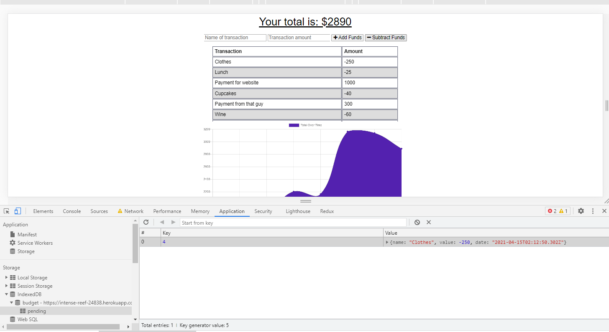

# PWA18-budget-tracker
For this assignment, I was instructed to add functionality to our existing Budget Tracker application to allow for offline access.

The user will be able to add expenses and deposits to their budget with or without a connection. When entering transactions offline, they should populate the total when brought back online.

## Offline Functionality:

  * Enter deposits offline

  * Enter expenses offline

When brought back online:

  * Offline entries should be added to tracker.

## User Story
AS AN avid traveller
I WANT to be able to track my withdrawals and deposits with or without a data/internet connection
SO THAT my account balance is accurate when I am traveling

## The app

## The app functioning offline

## The data saving in MongoDB once online again

[Link to Deployment](https://intense-reef-24838.herokuapp.com/)
